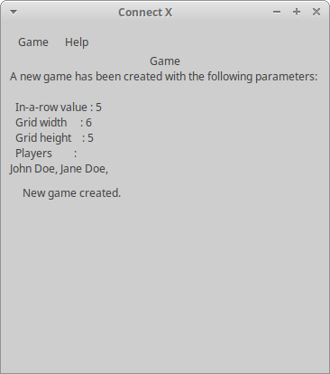
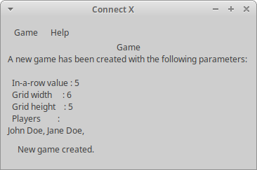

# Connect X v0.14 (May 31, 2020)

## New features

In this iteration, the Connect X status bar now follows the _Game_ view when updated. In other words, the status bar now always is located at the bottom of a view, even if it changes size.

## Status bar

The status bar is now at the bottom of the content of a view. For example, the _Game view_ now has the status bar at the bottom, no extra spaced added:

|       Before (v0.13)        |      After (v0.14)        |
| :-------------------------: | :-----------------------: |
|  |  |