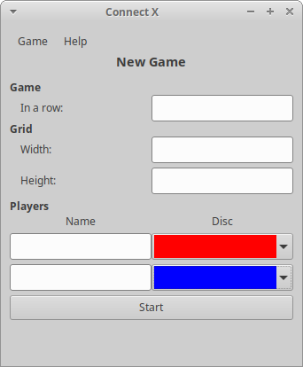
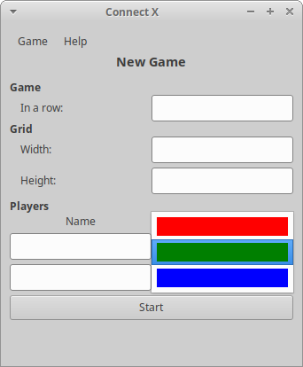

# Connect X v0.15 (September 13, 2020)

## New features

In this iteration, the Connect X _New Game_ dialog now offers combo boxes for selection colors, instead of simple entries.

## Combo boxes for displaying colors

The _New Game_ dialog now offers picking a disc color directly using a combo box:

For now, only three color choices are available:

Note that users must select different colors for a new game to be valid.