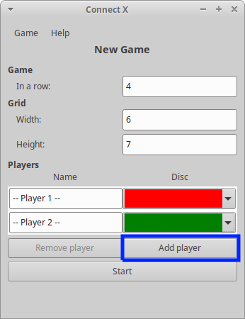
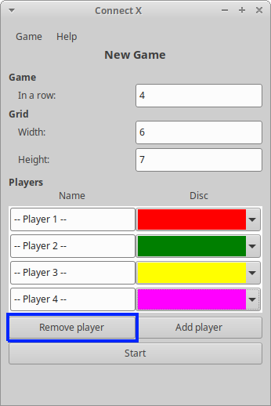

# Connect X v0.16 (September 27, 2020)

## New features

In this iteration, the Connect X _New Game_ dialog now offers the possibility to register _n_ players.

## Registering more players

The _New Game_ dialog now offers adding (and removing) players for a new game using the "Add player" button. The minimum number of players is 2 and the maximum is 10.

When extra players are added, it also becomes possible to remove them through the "Remove player" button:

Note that users must select different colors for a new game to be valid.