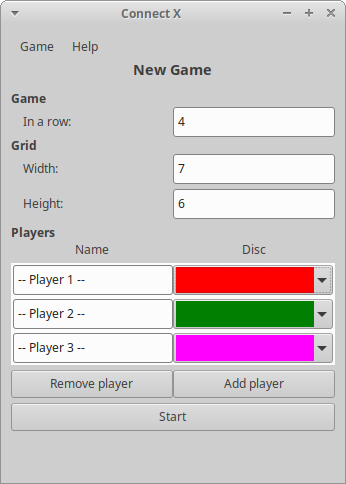
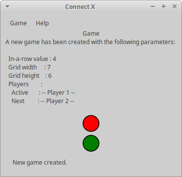
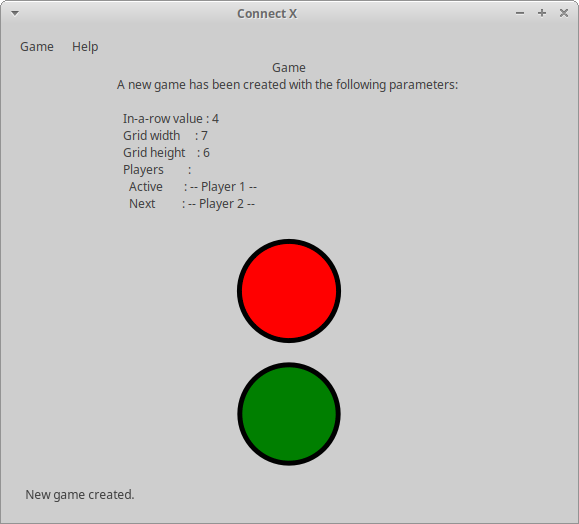

# Connect X v0.17 (October 11, 2020)

## New features

In this iteration, the Connect X _Game_ view displays scalable chips.

## Scalable chips

When a new game is created, disc information is now displayed in the _Game_ view for both the first and
second registered players. These two players are displayed as the _active_ and _next_ players respectively
because in a near future disc information will be displayed for these players only (i.e. the current
player and the one playing next).

A new game:

Disc information (active and next players only):

Note that the discs scale with the window:

