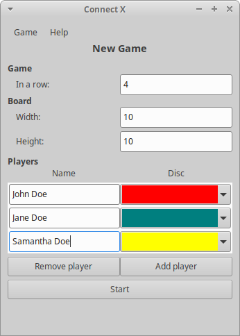
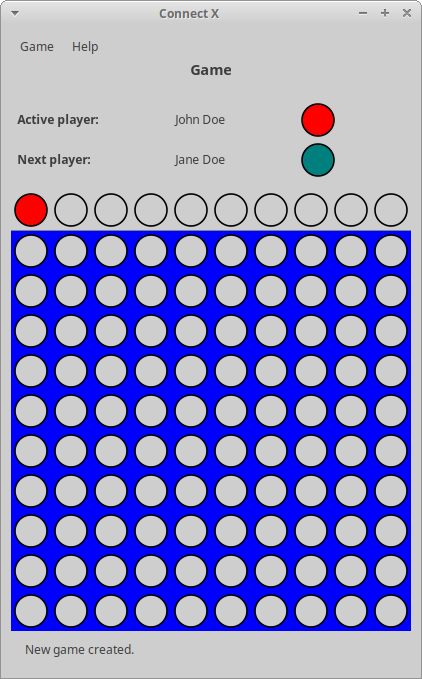
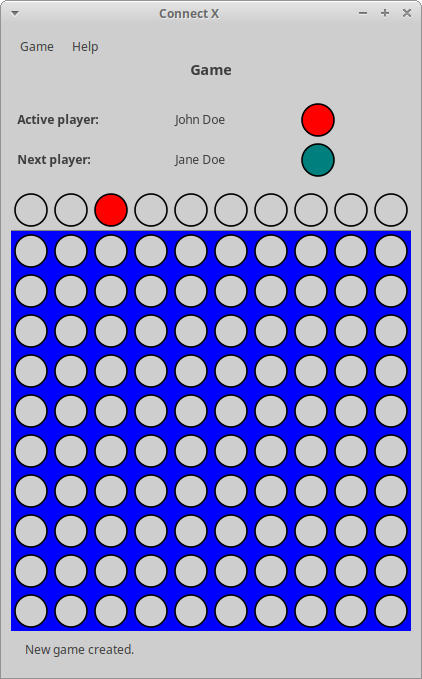
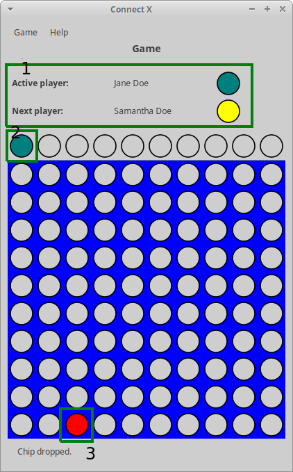
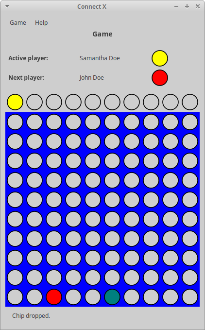

# Connect X v0.20 (November 22, 2020)

## New features

In this iteration:

1. it is now possible for users to drop discs inside the game board.
2. game information is updated when a disc is dropped.

## Drop discs

It is now possible for a user to use the _down_ arrow key to drop a disc inside the game board once a game is started. As discs are dropped, game information such as active and next player information, is updated. Here is an example of a complete workflow:

| New game created with three players | Game start                     | John moves two positions to the right |
| ------------------------------------| ------------------------------ | ------------------------------------- |
|           |  |      |

Then, John drops a disc (_down_ arrow key):

Note that when John dropped his disc, three things were updated:

1. Active and next players information.
2. In the next disc area, the disc is changed for Jane's disc (since she now is the active player) and its position is moved back to the first column.
3. In the game board, John disc is show.

Also, note that the status bar was updated to show "Chip dropped.". From then, the game can go on until the board is full. For example, if Jane now moves to the fifth column and drops her disc:

Note that when a column is full, dropping a disc has no effect.