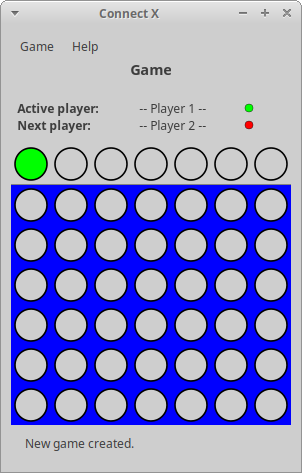
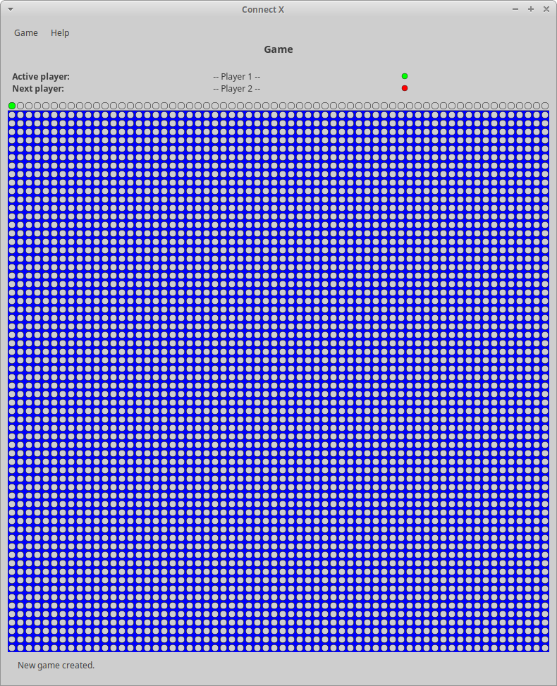
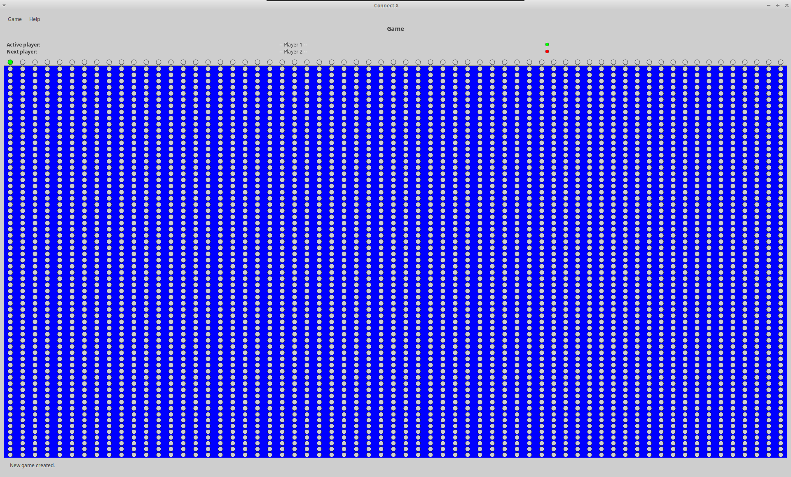

# Connect X v0.21 (December 6, 2020)

## New features

In this iteration:

1. make the game view behave appropriately on resize.

## Resizing the Game view.

When big boards are created or when the Game view is resized by a user, it is important that it stays usable. In this
iteration, default board dimensions have been review to make sure they always fit the user's screen, an resize accordingly
when the user requests so. This has been made possible by adapting the chips sizes to the user's screen. So, for a 6x7
game board, we have:

While for a 64x64 board, on the same screen, we have:

When maximized:

And all of these fit the user's screen.
