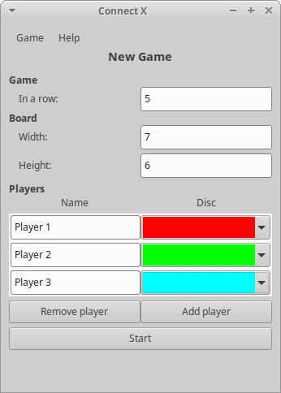
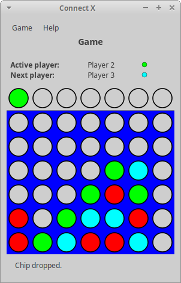
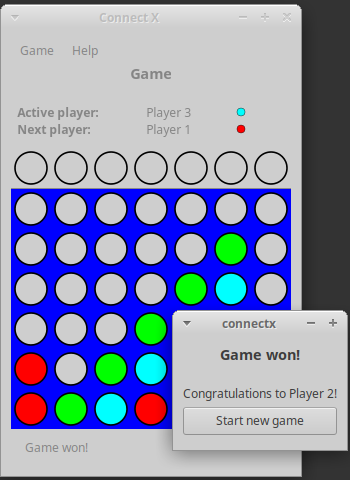

# Connect X v0.22 (December 20, 2020)

## New features

In this iteration:

1. When a player first aligns the right _in-a-row_ number of chips, the game is won.
2. When a player wins a game, a new game can be started without leaving the software.

## Winning a game

When a player first aligns the right _in-a-row_ number of chips, a win is detected and
the game stops. A dialog is shown with the winner's name. Note that although the dialog
is modal, the game board is still visible, allowing players to check out the board.

For example, let's say a three player game is started. The _in-a-row_ value is 5:

After some moves, the game looks like this:

And the second players drops the winning disc at column 6: the winning dialog pops out:

## Starting a new game after a game win

When the _Start new game_ button is clicked, players are brought back to the _New Game_
view, in case they want to start another game. The values that were first input by
the players are still available, in case they simply want to start over. Of course,
if they wish, they can modify any game parameters before starting again.

