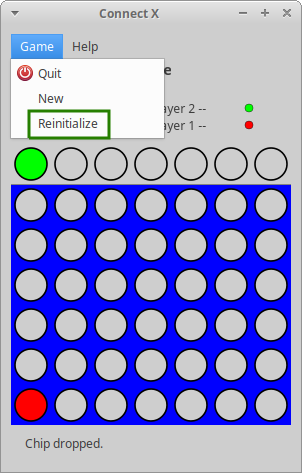
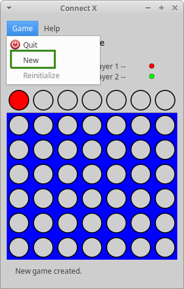

# Connect X v0.23 (January 3, 2021)

## New features

In this iteration:

1. a new menu item to reinitialize the current game has been added;
2. a new menu item to start a new game has been added.

## Reinitializing the current game

If a user is in the middle of a game and for some reason does not wish to
finish it, but would like to start it over, a new menu item has been
added:

Note that this menu item is only available when at least one chip has been
dropped.

## Starting a new game

If a user is in the middle of a game and for some reason does not whish to
finish it, but would like to start a new game (possibly with new game
parameters), a new menu item has been added:

Note that this menu item is only available when a new game has already been
created and the user is in the _Game_ view.
