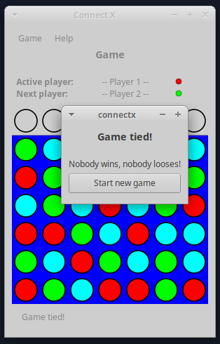

# Connect X v0.24 (January 17, 2021)

## New features

In this iteration:

1. it is now possible to tie a game.

## Tie games

Whenever a board is completely filled with discs and no winner has
been detected, the game is considered a tie and a dialog appears to
notify players and help start another game:

Just like where a winner is detected, clicking the _Start new game_
button will bring players back to the _New game_ view where they
can start the game over or configure a new game.
