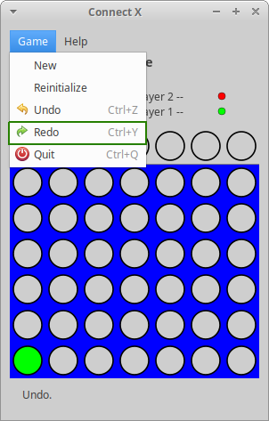

# Connect X v0.26 (February 14, 2021)

## New features

In this iteration:

1. The possibility to redo a disc drop (that was previously undone) was added.

## Redo the last disc drop

### Redoing a disc drop

When the following conditions are met:

1. a game has been started;
2. one (or more) discs have been dropped;
3. one (or more) drops have been undone.

redoing is unlocked. At this point, a user can go in the `Game->Redo`
menu to undo his last disc drop:

Alternatively, the user can hit `Ctrl + y` to redo his last undone disc drop.

### Bug with key accelerators

For some reason, key accelerators are not shown (although they work fine
if one remembers the key combinations) in the menu with some Gtkmm
versions (3.22.30 being one of them). I tested with Gtkmm 3.24.24
and they are displayed fine.