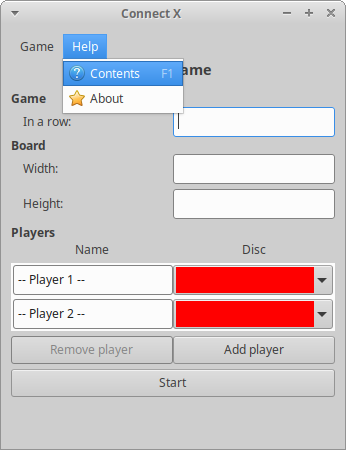
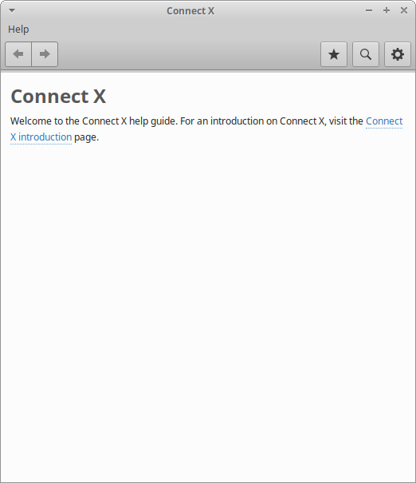

# Connect X v0.29 (May 9, 2021)

## New features

In this iteration:

1. an offline documentation item has been added to the menu;
2. an introduction section has been added to the offline
   help contents.

## Offline documentation

Under the _Help_ menu item, a new _Contents_ button has been
added, above the _About_ button:

When clicking on this button (or hitting F1), the Gnome help
browser is launched:

For now, only an introduction to Connect X has been added, but
more contents will come later.
