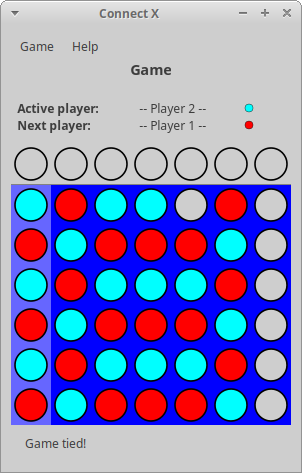
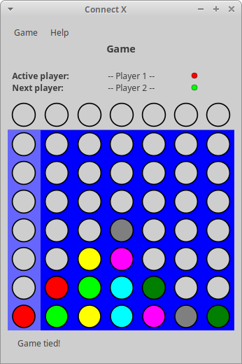
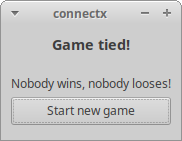

# Connect X v0.30 (May 23, 2021)

## New features

In this iteration:

1. an improved tie algorithm is introduced;
2. a new section has been added to the Connect X offline documentation.

## Improved tie detection

The previous tie algotihm simply declared a game was a tie if by the time
the board was full, no player had won. In the new version of the algorithm
implemented in this release, most ties are detected early (i.e. before
the board is full). For example:

In some situations, this early detection can save a lot of time. For
example:

As before, when a tie occurs, the usual confirmation dialog appears:

## Offline documentation

A new section on how to create new games has been added.
