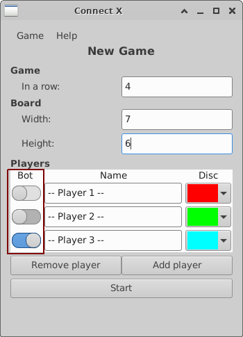

# Connect X v0.34 (December 11, 2022)

## New features

In this iteration:

1. Bot players are added.

## Bot players

It is now possible to play against bot players. When launching a new game, one can now indicate
that a player must be controller by the computer:

In this example, the first and second players are not bot because the bot switch is off. The third
player, on the other hand, is a bot and will be controlled by the computer.

Notes about bots:

 1. For now, the first player can never be a bot.
 2. When undoing/redoing changes, all bot players moves are undoed/redoed as well.
