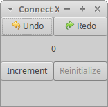
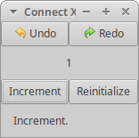

# Connect X v0.8 (March 8, 2020)

## New features

In this release, a status bar has been added to the application.

## Status bar

When the application is launched, a new status bar widget is included in the main window (bottom of the window):

After a user has done some action, a string indicating the action is printed in the status bar. For example, when the user clicks the "Increment" button, we get this:

