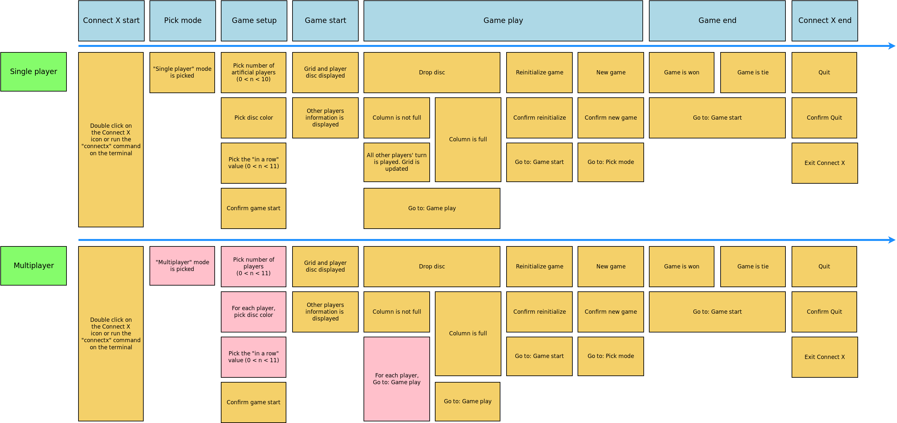

# Connect X v0.9 (March 22, 2020)

## Sprint objectives

In the current sprint:

1. a menubar was added to the application;
2. the application workflow was defined.

## Menu bar

This feature is fully described [here](../user/user.md).

## Application workflow

The following user story map describes the basic user workflow wanted for the first official
release:

## Next sprint

In the next sprint, the objectives will be:

1. analyse and create a mock of the New Game dialog;
2. analyse and create a mock of the About dialog;
3. implement the About dialog.
