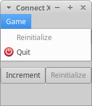

# Connect X v0.9 (March 22, 2020)

## New features

In this iteration, a menu bar has been added to the application.

## Menu bar

A menu bar has been added to the application:

For now, only the _Game_ menu is present. Two menu items are present in the _Game_ menu:
_Reinitialize_ and _Quit_. The first reinitializes the counter. It is an equivalent of the
Reinitialize button. The second exits the application. It is the equivalent of the top right "x"
button.