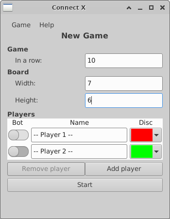
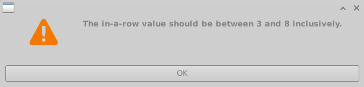
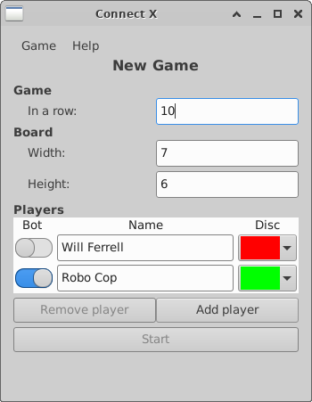
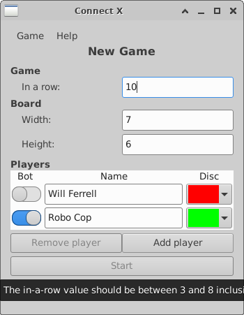

# Connect X v1.1 (March 9, 2023)

## New features

In this iteration:

1. The `Start` button for starting new games will not let
   users click on it unless all game parameters are valid.

## `Start` button updated.

The `Start` button, up to now, was clickable all the time. Only
upon clicking it would a player get feedback on its game setup
in the form of agressive message boxes. For example, here is
an unwinnable game (the in-a-row value is too large for the
board dimensions), with the `Start` button clickabled:

If clicked, a message box pops up:

This workflow has been reviewed to make the `Start` button
unclickable (it's greyed out) until all game parameters
are valid. This means that if the `Start` button is clickable,
you know the game is valid. Otherwise, you know there is
a problem. The example above then becomes:

One nice thing about the agressive message boxes is that
they displayed the cause of the error to the player. With
this new workflow, the cause of the error it still displayed
in the form of a tooltip on the start button:

So in cases where the error is not self evident, the user
can consult the tooltip to see where the problem lies. The
message contained in the tooltip is the same as what was
displayed in the message boxes previously.
