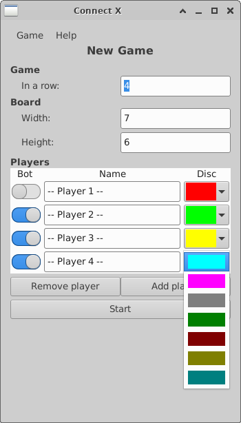

# Connect X v1.3 (April 9, 2023)

## New features

In this iteration:

1. Chip color selection behavior enhanced.

## Chip color selection

In the *New Game* dialog, when adding a player, the default color was always red. This
required every click on "Add player" to be followed by a change of chip color, otherwise
there were duplicate red chip color selections and the game could not be started.

Changing the chip color should not be the typical case. Most players would be happy with any
default colors. Because of this, the behavior of the chip color default selection has been
improved: when adding a new player, the default chip color is always a color that has not
yet been selected by the existing players. Furthermore, when clicking the dropdown control
to pick a new color, only colors that have not yet been selected are made available:

This helps users not accidently selecting a duplicate colors.
