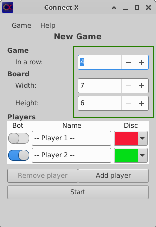

# Connect X v1.7 (December 10, 2023)

## New features

In this iteration:

1. Edit boxes in the _New Game_ view have been replaced by spin boxes.

## New spin boxes

Edit boxes in the _New Game_ view have been replaced by spin boxes. This
makes it clearer for the user what the limits are. The user can explore
without having to go through error messages.

Note that:

 1. Left-clicking on the up/down arrow will increase/decrease the value by one.
 2. Middle-clicking on the up/down arrow will increase/decrease the value by ten.
 3. Right-clicking on the up/down arrow will clamp to the max/min value.
