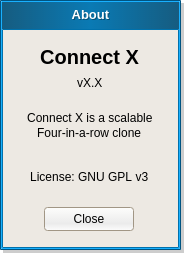
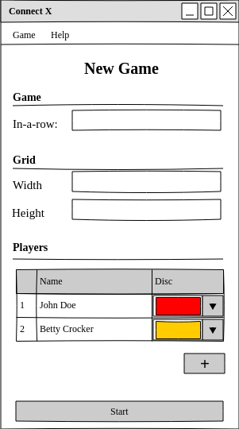

# Connect X v0.10 (April 5, 2020)

## Sprint objectives

In the current sprint:

1. mocks for an About and a New Game dialog added;
2. About dialog implemented. 

## Dialog analysis 

### About

Here is the mock for the About dialog:

In the implementation, a copyright notice has been added to the dialog, like in the `--version` command line argument.

### New Game

Here is the mock for the New Game dialog:

## About dialog implementation

This feature is fully described [here](../user/user.md).

The implementation uses a new `cxgui::Window` class which encapsulates the dialog creation using the Gtkmm library. All dialogs should use this class for their implementation.

## Next sprint

In the next sprint, the objectives will be:

1. remove the test code from the coverage analysis; 
2. analyze the main Game dialog; 
3. make the `cxgui::MainWindow` use the new `cxgui::Window` for its implementation;
4. add the Connect X icon to all dialogs.
