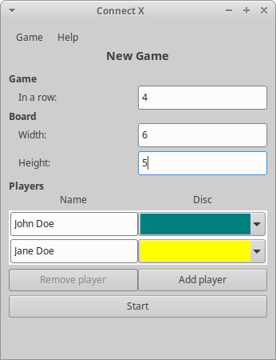
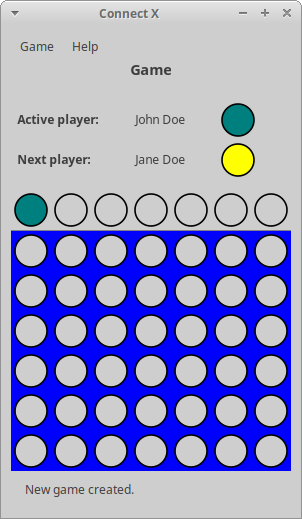
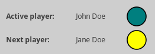
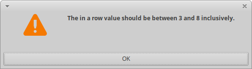
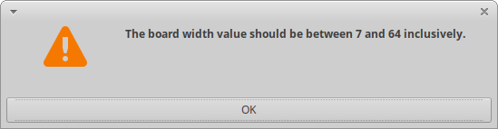

# Connect X v0.18 (October 25, 2020)

## New features

In this iteration:

1. the game board was added to the _Game view_;
2. the _Game view_ now offers player information only for the active and the next players;
3. limits for the _in a row_ value as well as the grid dimensions are now tested for validity in the _New Game_ view.


## Game board

When a new game is created and the _Game view_ is displayed, a game board is now available. For example, the following _New Game_ view configuration will yield the following game board:

|       *New Game view*       |          *Game view*           |
| --------------------------- | ------------------------------ |
|   |  |

The game board has two sections:

1. the first row, with the active player's disc displayed, is the _Next disc area_;
2. successive rows (in blue) are simple game board rows, where, eventually, dropped discs will be displayed.

Note that it is possible to use the `left` and `right` arrow keys to move the active player's disc in the _Next disc area_ to the left and to the right (respectively). Furthermore, if the `down` key is pressed, the following note will appear in the console (but nothing is going to happen in the _Game view_ itself:

```
> Drop!
```


## Active and next players

When a new game is created, the active and next player information is displayed in the _Game View_:



For now, this information, once in the _Game view_, is static because it is not yet possible to drop a disc in the board.


## Limits

As of now, there were no limit checks for the following fields in the _New Game_ view:

* In a row
* Board width/height

As long a a user entered a numerical value in the fields, the view was happy. This means that a user could, for example, create a new game with a board width of -1! Limits are now tested for those fields and a new game creation is not possible unless all limits are respected. If not, the following messages appear:

In a row:



Width/Height:



