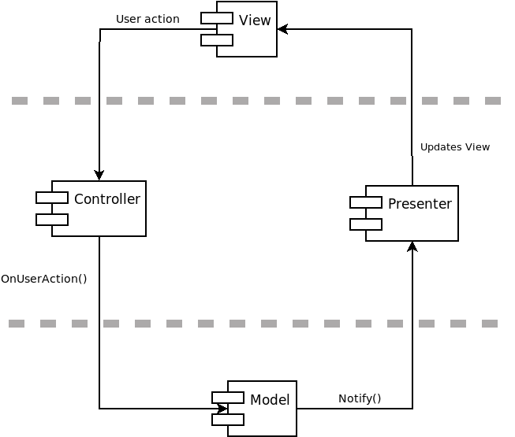

# Connect X v0.2 (December 15, 2019)

## Sprint objectives

In this sprint, there are two main objectives:

1. Add support for the standard command line arguments `--version` and `--help`.
2. Analyze the `cxmodel` library and prepare a high level architecture plan.

## Support for `--version` and `--help` command line arguments.

This new feature is described in details in the [user documentation](../user/user.md).

## Architecture

### High level architecture

The Model-View-Presenter (MVP) pattern will be used. The MVP pattern will be tweaked a little bit, however, to logically decouple user actions from view updates, through the use of controllers. Visually, the pattern looks like the below figure.

In this architecture, when a user does a user action on a _View_ (e.g. clicking on a button), the handling is transferred to the corresponding _Controller_ (there might be more than one), which tells the _Model_ to update itself accordingly. Once the _Model_ is done updating itself, it notifies the corresponding _Presenter_ (there might be more than one) to update itself. The _Presenter_ then updates the _View_. The grey lines in the picture depict architectural boundaries, which isolate these concepts from one another.

Here is a brief description of each module:

1. __Model__: holds all business logic. The _Model_ does not know about the _Controller_, _Presenter_ or the _View_.
2. __Controller__: is responsible to handle every user action. The controller knows about the _Model_, but not the _Presenter_ nor the _View_.
3. __Presenter__: is responsible to update the _View_ according to the current _Model_ state. It knows about the _View_, but not the _Model_.
4. __View__: displays the information to the user. It is a visual representation of the _Model_ and gives the user the possibility to act on it through specific interfaces (e.g. buttons). The _View_ knows about the _Controller_ and the _Presenter_, but does not know about the _Model_.

Note again that there might be more than one _Controllers_ and _Presenters_ (typically one per _View_). There will be many _Views_. The interactions between the _Model_ and the _Presenter_ use the Observer design pattern to completely decouple both.

### The `cxmodel` library

The `cxmodel` library corresponds to the _Model_ module in the architecture described above. I have decided to postpone any decisions regarding this library. For now, I will concentrate on making sure the above architecture is setup accordingly. Business logic details will come later.

## Next sprint

In the next iteration, I will start working on necessary pieces to achieve the above architecture:

1. the observer pattern will be set up;
2. a minimal GUI will be created;
3. the `cxinv` package from the old project will be brought in and integrated into the existing code.