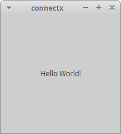

# Connect X v0.3 (December 29, 2019)

## New features

A minimal graphical user interface (GUI) now displays "Hello World!".

## Minimal GUI

A minimal GUI has been created to show the "Hello World!" string previously printed on the console. Note that for now, no user interaction is possible with the GUI, to the exception standard window features, such as minimizing and closing.

Note that both `--help` and `--version` command line arguments behave exactly as in v0.2. No GUI has been created for them.