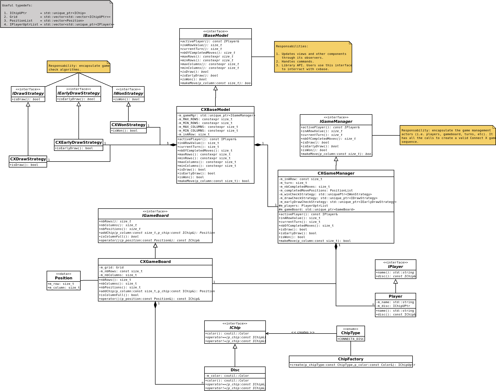

# Connect X v0.5 (January 26, 2020)

## Sprint objectives

In this sprint, there are two main objectives:

1. add generic undo/redo capabilities to the application;
2. review the updated Connect X business logic design.

## Generic undo/redo

The command pattern was used to add these capabilities. Undoable actions are encapsulated into commands the can restore the previous state if needed.

See [the user documentation](../user/user.md) for the user related features.

## Business logic design review

Before the last Connect X project was abandoned, a refactoring was planned. This refactoring is show in the following diagram.

The model for the current Connect X project will be designed according to this architecture (although implementation details may vary).

## Next sprint

In the next sprint, the following items will be adressed:

1. add logging capabilities;
2. add all possible warning options to the build process.