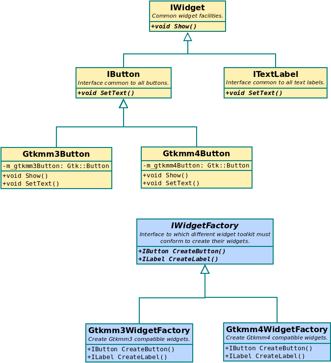

# The abstract widgets factory

## Contents
1. [Motivation](#motivation)
2. [Architecture overview](#architecture-overview)
3. [Specific framework elements](#specific-framework-elements)
4. [Extending for Connect X specific widgets](#extending-for-connect-x-specific-widgets)
5. [Bibliography](#bibliography)


<a name="motivation"></a>
## 1. Motivation
While Gtkmm is a GUI library which is fun to work with, its API is pretty unstable. From
ong version to another majors API changes frequently occurs, which make maintenance a pain.
Much effort is put into the UI code, which is later broken by these API changes. The
views code depend directly on Gtkmm which triggers views code changes to restore
functionnalities that were broken by Gtkmm API changes. These changes can result in new
bugs that can creep in, unnoticed. Lastly, if one of these changes ever breaks too
much functionnalities and that a migration to another toolkit is needed, it is going
to be really hard with the current state of things because too much code depend
directly on Gtkmm.

Since Gtkmm3 is now deprecated and that Gtkmm4 will soon be the new standard on Ubuntu LTS
distros (and many others), a migration was needed. I have decided to take advantage of
this. The migration will not happen by simple "call replacements", but rather I will
add an indirection layer between the views and the Gtkmm related code, freeing myself
from it at the same time. With this approach, later migrations should be easier and
much less risky. Moving to another framework (if that ever becomes a need) also.


<a name="architecture-overview"></a>
## 2. Architecture overview
To achieve this, the *Abstract Factory* design pattern is going to be used. I have been
wanting to try this pattern for a while, and this seems like the perfect application
for it. It even is the application described in the GOF book.

The basic idea is that the underlying GUI toolkit must be completely encapsulated,
such that the Connect X application code nevers knows what toolkit it is actually
using. This additionnal level of indirection will come into the form of an abstract
widgets factory:



In this UML class diagram, a first class hierarchy is created for the individual
widgets. All widgets implement the same `IWidget` interface and specialize it to
their own needs. Only the final implementation is GUI toolkit specific. This final
implementation is hidden behind an interface (for example: `IButton` for buttons)
which will be what Connect X is going to be using.

Creating these widgets will be the responsibility of the abstract factory, which
will have an implementation for all supported toolkits. The abstracty factory
will select the needed implementation at construction time and from there, will
create the widgets using the appropriate implementation, while only making the abstract
interfaces available ton Connect X.


<a name="specific-framework-elements"></a>
## 3. Specific framework elements
The main goal for this new framework is not to expose a complete GUI toolkit API,
but rather to free ourselves from the GUI toolkits. Only the necessary elements
should be exposed in this framework and simplicity of use should be the main
criterion when doing the design. It is not a problem that fundamental widget
properties are not exposed if never used in Connect X. They will be added when
the need arises.

### 3.1. Widgets
The abstract factory will expose all of its widgets through inferfaces. The call
for creating a button could look something like this:

```c++
std::unique<IButton> button = factory.CreateButton();
```

where the type `IButton` is GUI toolkit agnostic. It should only know about
`std` and Connect X types, nothing more. Like in most GUI toolkits, the
widgets get more and more specialized through inheritance. So one could
also write:

```c++
std::unique_ptr<IWidget> button factory.CreateButton();
```

if all that is needed later on is the generic `IWidget` interface. For reasons
that will become clear in the next section, all specific widgets implementations
should also publicly inherit from the toolkit's interface for that widget. For
example, the button implementation for the Gtkmm toolkit would look something
like:

```c++
class Gtkmm3Button : public IButton,
                     public Gtk::Button
{
    // ...
};
```

but only the `IButton` interface is exposed through the factory and hence is
available in the calling code. In short, this is because for some applications
(such as containers), casting to the toolkit's specific type is necessary in
the implementation. More on this later.


### 3.2. Containers
Containers are a type of GUI element that is not directly visible by the
user of the software. Their task is to spatially arrange widgets inside
the window. In GTK, they are known as containers, in Qt, they are known
as layouts.

One important detail about containers is that they *are* not widgets, they
*contain* widgets. Another important detail is that their implementation
needs to know about the underlying GUI toolkit for the widgets they are
manipulating. For example, let's say we have this container class:

```c++
class IContainer
{

public:

    virtual void Add(IButton& p_button) = 0;
};

class Gtkmm3Container : public IContainer
{

public

    void Add(IButton& p_button) override
    {
        // How to deal with p_button here?
    }

private:

    Gtk::Grid m_grid;
};
```

The Gtkmm 3 `Add` implementation cannot add the button because all it knows
about is the `IButton` interface, which is Gtkmm agnostic. This is where we,
as implementers of the abstract factory, will use our private knowledge that
in this case, `p_button` also inherits from `Gtk::Button` (see previous section).
Because of this, we can use casting to solve the problem:

```c++
    void Add(IButton& p_button) override
    {
        Gtk::Button* gtkmmButton = dynamic_cast<Gtk::Button*>(p_button);
        assert(gtmkkButton);
        m_grid.attach(*gtkmmButton, 0, 0, 1, 1);
    }
```
Note that the assertion should always hold, since we designed for it.


### 3.3. Windows
Soon...


### 3.4. Connecting to signals


<a name="extending-for-connect-x-specific-widgets"></a>
## 4. Extending for Connect X specific widgets
Soon...


<a name="bibliography"></a>
## 5. Bibliography
Soon...
